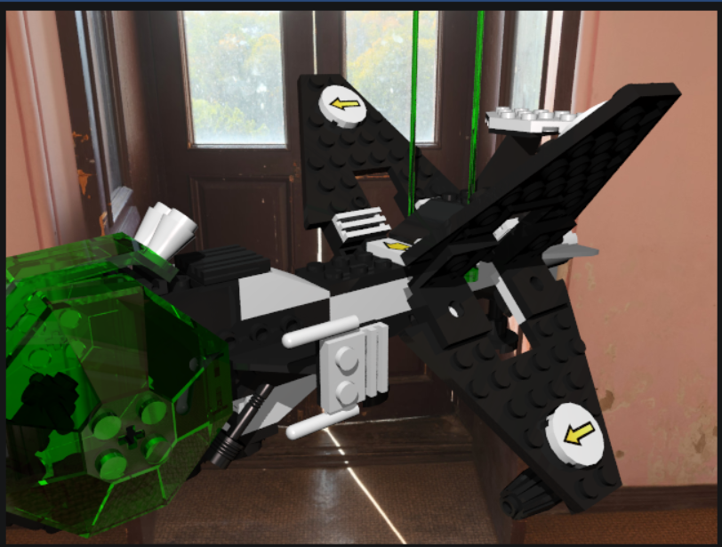

# Project for Computer Graphics 1 class 

Project with goal of achieving photorealistic images using methods such as

	- ray tracing
	- lightning models
	- bidirectional reflectance distribution function (BRDF)
	- global illumination
	- Monte Carlo

 
